# 2.4 – Infrastructure Build Guide: Anti-Spoofing Fabric (DHCP Snooping, IP Source Guard, DAI)

> A visual narrative documenting the transition from a passive routing engine to an active hardware-level security enforcer, utilizing wire-speed cryptographic binding checks to prevent IP and MAC spoofing.

---

## Overview

This guide details the deployment of a comprehensive anti-spoofing fabric on VLAN 20 (the Untrusted Work network). Because the primary endpoint utilizes a static IP, this lab covers the manual injection of trust anchors into the DHCP Snooping Binding Database, the remediation of hardware TCAM conflicts when enabling IP Source Guard (IPSG), the activation of Dynamic ARP Inspection (DAI), and the resolution of the "No Snoop VLAN" database exception. Finally, it validates the ASIC's enforcement via a deliberate inverse-spoofing drop test.

---

## Workflow Steps

### 1. Act I: The Trust Anchor (Static Binding)
The Work Laptop (WL) utilizes a static IP assignment (`192.168.20.100`), which bypasses the standard DHCP DORA process. Enabling security features without an established trust state would immediately lock the device out. We first needed to establish a hardware trust anchor.

**Static Host Injection:**
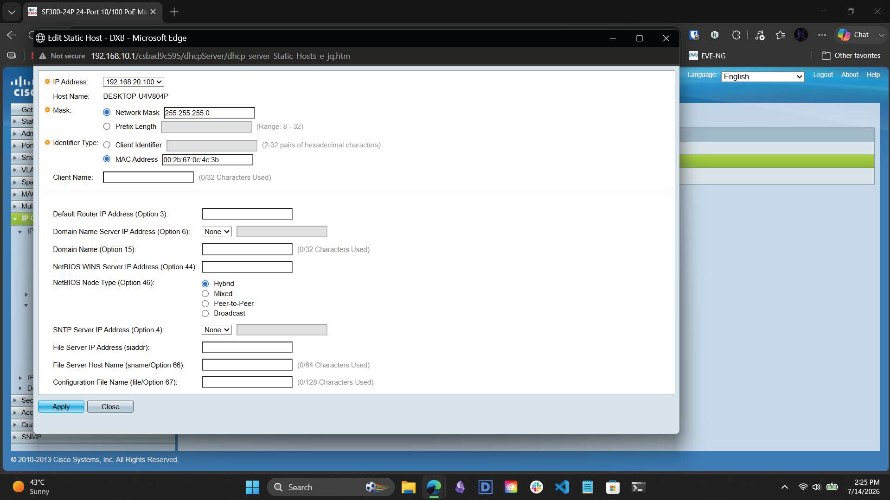
*Manually mapping the physical MAC address `00:2b:67:0c:4c:3b` to IP `192.168.20.100` within the DHCP Server Static Hosts registry.*

**Static Hosts Database Verification:**
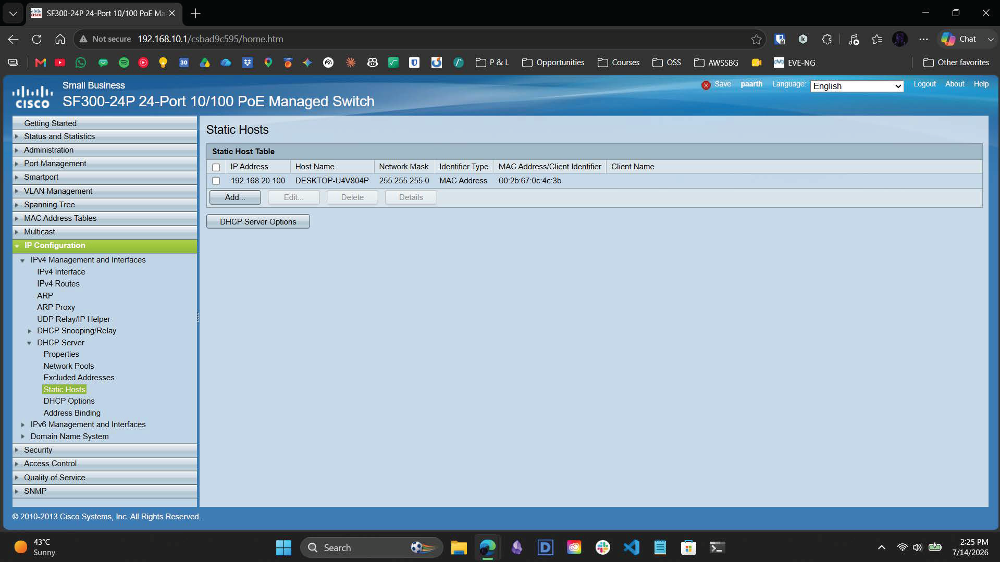
*The mapping is successfully committed, serving as the foundational trust anchor for the non-DHCP client.*

### 2. Act II: DHCP Snooping Daemon Activation
With the anchor established, we activated the core daemon responsible for intercepting and validating lease communications.

**Global Daemon Enablement:**
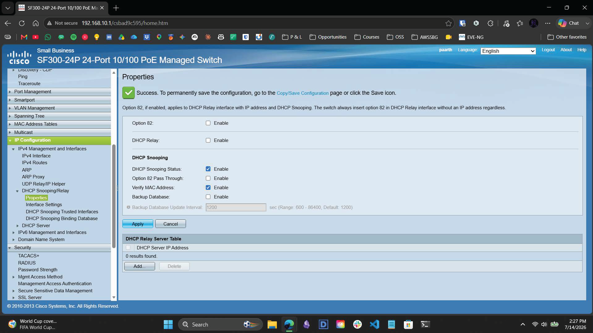
*Activating the global DHCP Snooping status and enabling MAC Address Verification to prevent rogue DHCP server attacks.*

**Port Trust Isolation:**
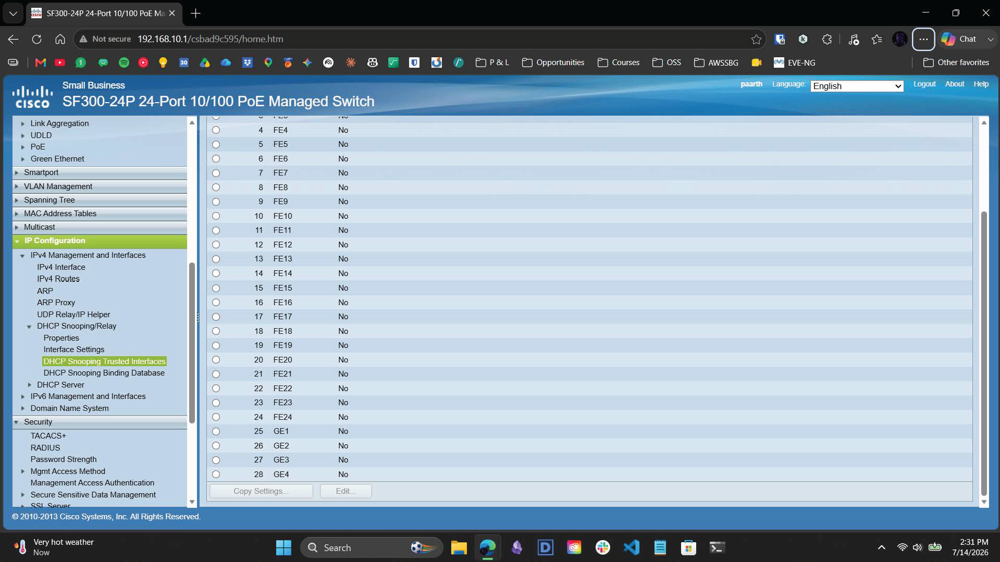
*Reviewing the Trusted Interfaces table. Crucially, all client-facing ports (FE1 through GE4) are strictly left in the default `No` (Untrusted) state, isolating the fabric from downstream poisoning.*

### 3. Act III: IP Source Guard & TCAM Remediation
We moved to enable IP Source Guard (IPSG) on the ingress boundary (FE24). However, the Marvell ASIC cannot run both IPSG and legacy IPv4 Access Control Lists simultaneously on the same port due to Ternary Content-Addressable Memory (TCAM) limitations.

**TCAM Purge (Legacy ACL Removal):**
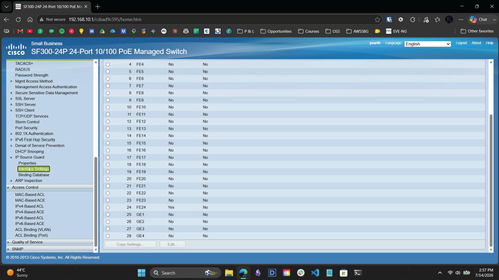
*To prioritize hardware-level spoofing protection over stateless filtering, we executed a complete purge of legacy IPv4 ACE/ACL bindings from port FE24.*

**Global IPSG Activation:**
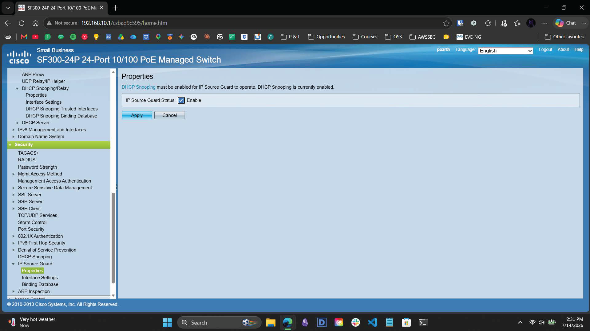
*Enabling the IP Source Guard daemon at the system level.*

**Ingress Boundary Enforcement:**
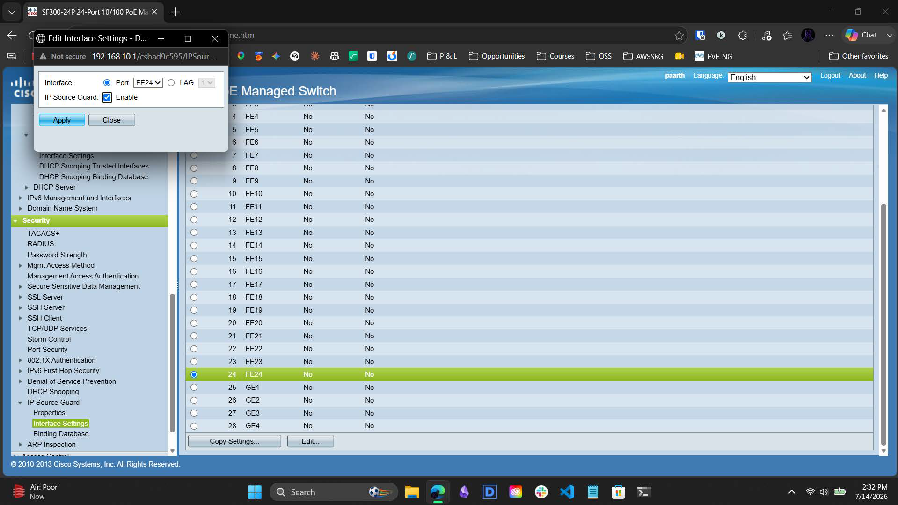
*With the TCAM conflict resolved, IP Source Guard is successfully bound directly to physical interface FE24.*

### 4. Act IV: Dynamic ARP Inspection (DAI)
To wrap the Layer 2 boundary, we activated protections against Man-in-the-Middle (MITM) ARP cache poisoning.

**Global DAI & Packet Validation:**
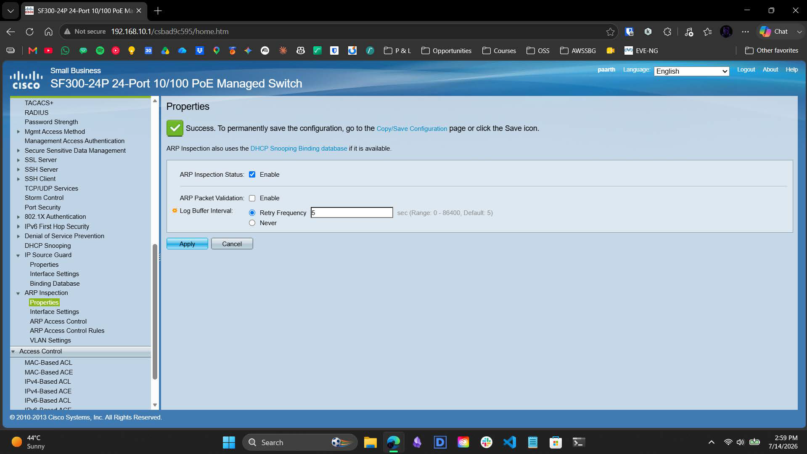
*Enabling ARP Inspection and activating deep packet validation.*

**VLAN-Specific Enforcement:**
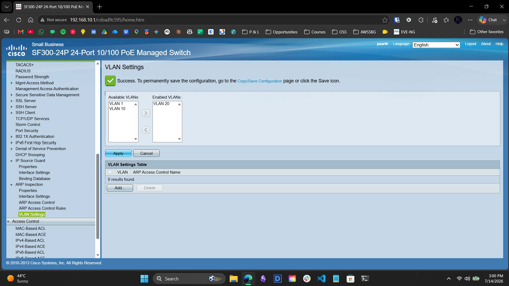
*Enforcing the DAI ruleset strictly on VLAN 20.*

### 5. Act V: Database Injection & The "No Snoop VLAN" Exception
To activate the static host's permissions, we manually injected the client into the active DHCP Snooping Binding Database.

**The Inactive Exception:**
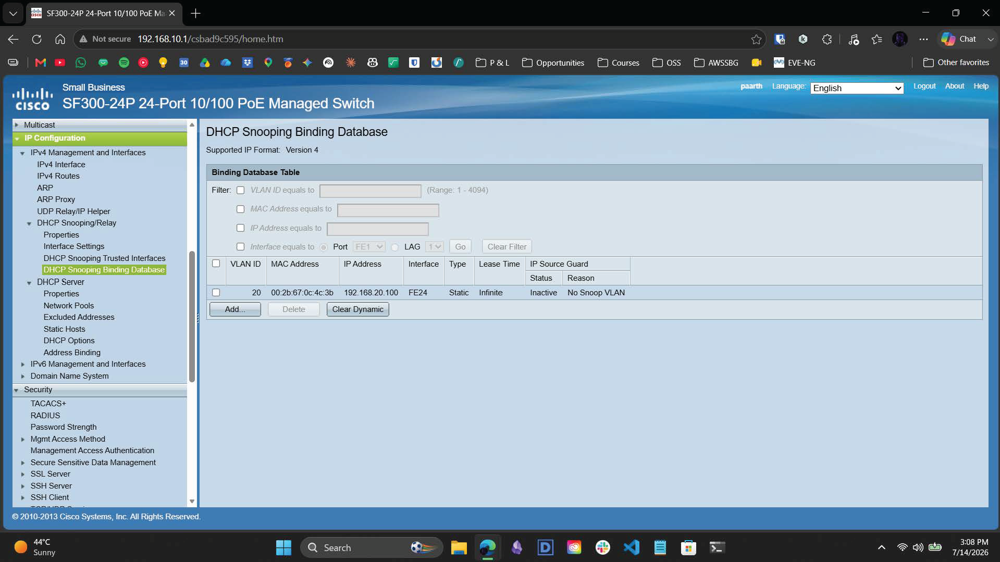
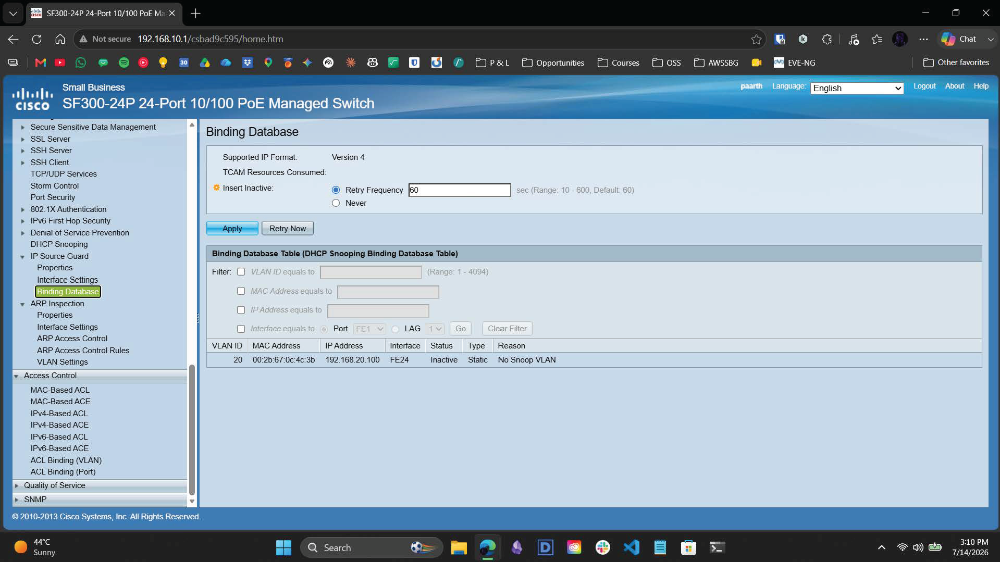
*Upon injection, the database returned an `Inactive` state with a `No Snoop VLAN` exception. Because the binding remained inactive, the ASIC began dropping all legitimate traffic from the WL.*

**VLAN Interface Remediation:**
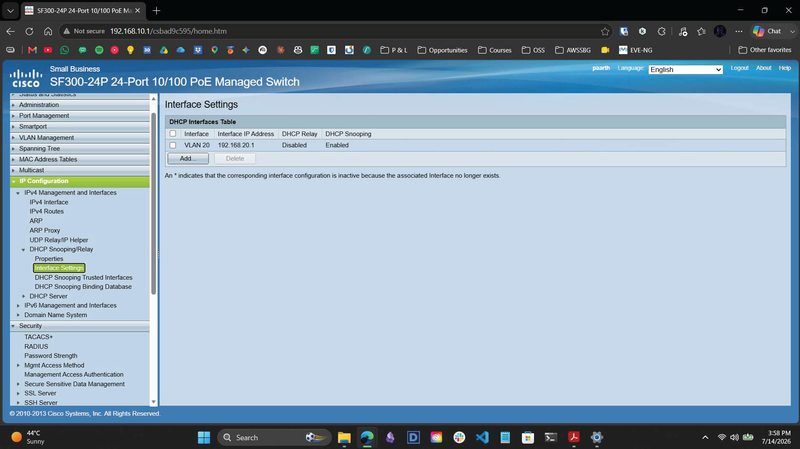
*The remediation: We navigated to the DHCP Snooping Interface Settings and explicitly linked VLAN 20 to the DHCP Snooping engine.*

**Active State Validation:**
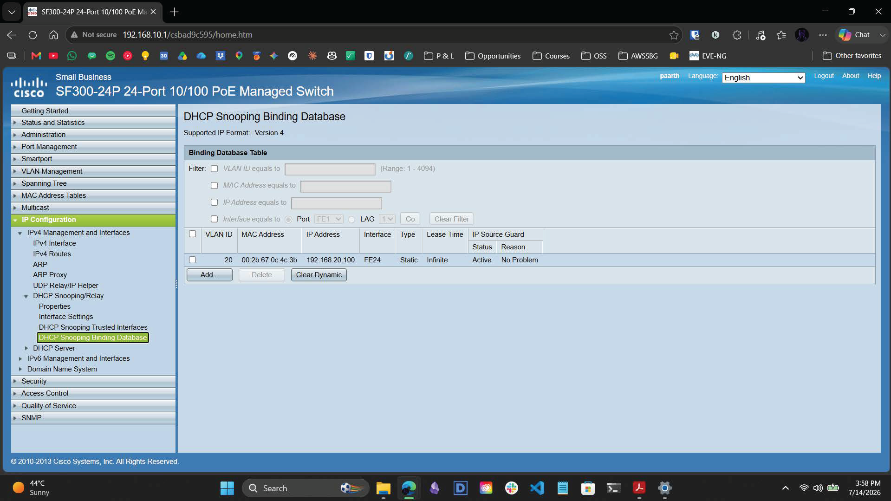
*Immediately following the interface link, the Binding Database re-evaluated the TCAM and updated the host status to `Active` with `No Problem`.*

### 6. Act VI: Hardware Gatekeeper State Validation
To definitively prove the switch ASIC is enforcing the L3-to-L2 cryptographic binding at wire speed, we executed an inverse spoofing drop test.

**Baseline Connectivity:**
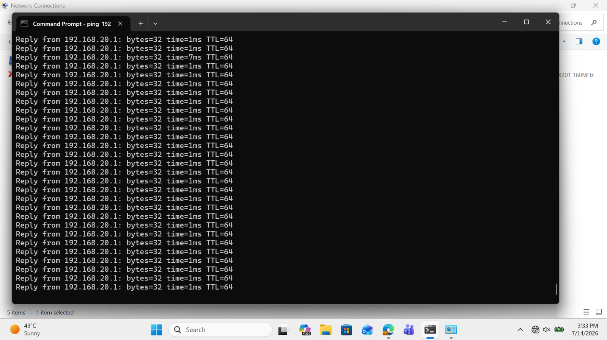
*A continuous ping from the WL confirms stable, `<1ms` baseline connectivity while the Binding Database matches the physical host.*

**The Inverse Spoofing Attack:**
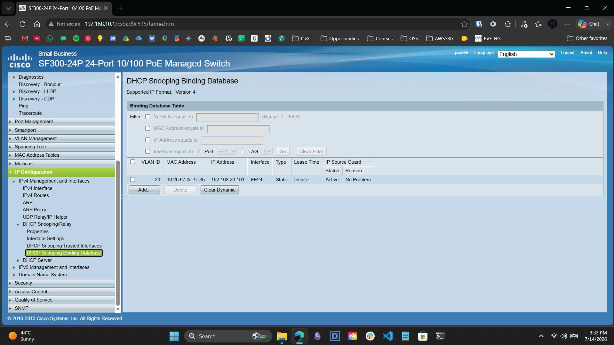
*We altered the active Binding Database expectation. We mapped the WL's MAC address to a fictitious IP (`192.168.20.101`). This simulates the WL attempting to spoof or communicate using an unauthorized IP.*

**ASIC-Level Drop Enforcement:**
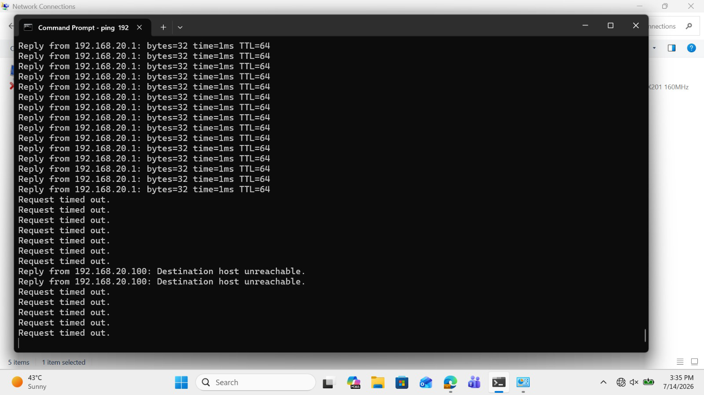
*The definitive proof. The instant the database was altered, the ASIC detected the mismatch and mercilessly blackholed the traffic. The terminal immediately shifts from `<1ms` replies to `Request timed out` and `Destination host unreachable`, proving the hardware gatekeeper is actively isolating unauthorized flows.*

---

## Technical Specifications

* **Core L3 Engine:** Cisco SF300-24P 
* **Target Boundary:** VLAN 20 | Interface FE24
* **Security Protocols:** DHCP Snooping | IP Source Guard | Dynamic ARP Inspection
* **Binding State:** `00:2b:67:0c:4c:3b` mapped to `192.168.20.100`

---

## Contact

For any questions or feedback, reach out:  
**Paarth Pandey** | [LinkedIn](https://www.linkedin.com) | [GitHub](https://github.com) | paarthdxb@gmail.com

---

> Author: Paarth Pandey
> 
> Enterprise IT/OT Infrastructure Security Lab Portfolio