# 2.6 – Infrastructure Build Guide: Advanced QoS (DSCP Trust) & Secure SNMPv3 Telemetry Engine

> A visual narrative documenting the deployment of wire-speed hardware-level DSCP trust boundaries and the implementation of an encrypted, authenticated SNMPv3 monitoring pipeline.

---

## Overview

This guide details the implementation of a Quality of Service (QoS) Trust Model and a secure, encrypted SNMPv3 monitoring architecture on the Cisco SF300. Due to physical ASIC memory constraints in Layer 3 mode, we abandoned traffic shaping in favor of a CoS/DSCP Trust architecture. Furthermore, we replaced insecure, plaintext SNMP with a robust SNMPv3 (AuthPriv) implementation to protect infrastructure telemetry from unauthorized access and interception.

---

## Workflow Steps

### 1. Act I: Navigating the Layer 3 QoS Hardware Constraint
Operating in Layer 3 mode with an active Routing Information Base (RIB) limits the switch's Ternary Content-Addressable Memory (TCAM). We bypassed aggregate rate policers, which trigger ASIC memory failures, by adopting a strict DSCP Trust Model.

**QoS Mode Activation:**
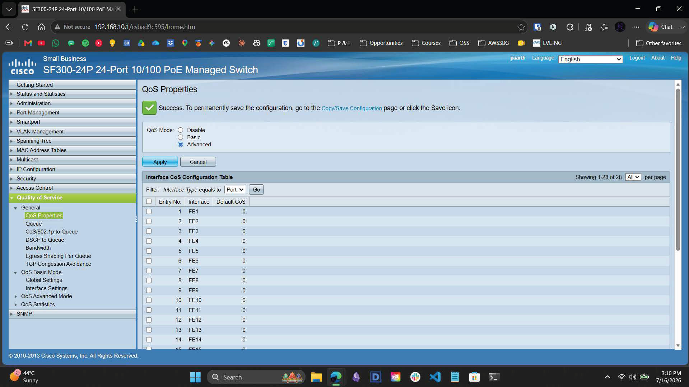
*Configuring the global QoS properties. We set the global mode to `Advanced` to allow for policy-based traffic classification.*

### 2. Act II: The Zero-Conflict Trust Engine
We created an IPv4 ACL (`qos-work-match`) to identify traffic from the Work Laptop. By routing this through the QoS policy pipeline instead of the security pipeline, we avoided TCAM conflicts with existing IP Source Guard bindings.

**ACL Classification:**
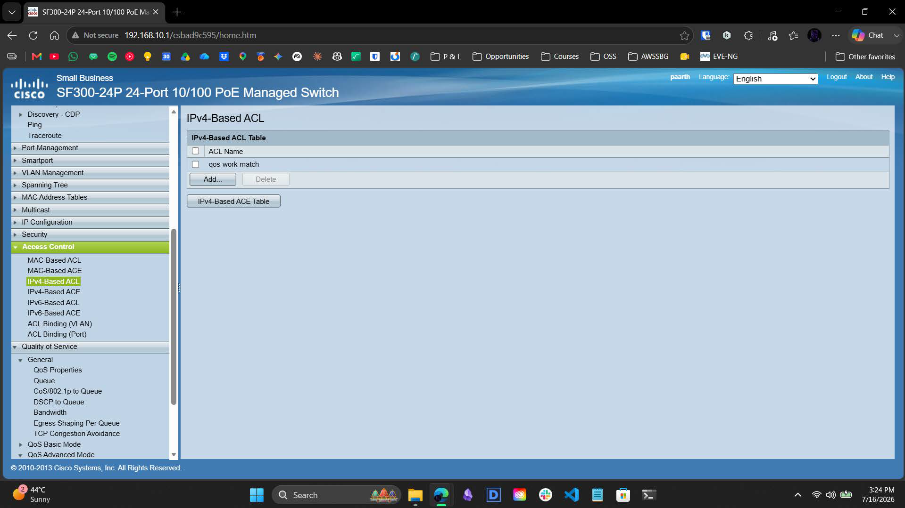
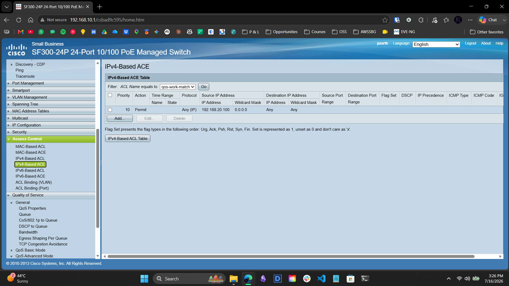
*Defining the `qos-work-match` ACL to permit traffic originating from `192.168.20.100`.*

**Policy Class Mapping & Binding:**
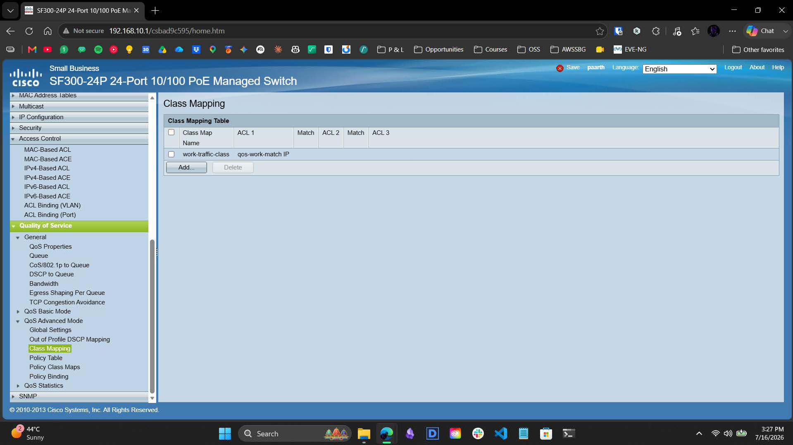
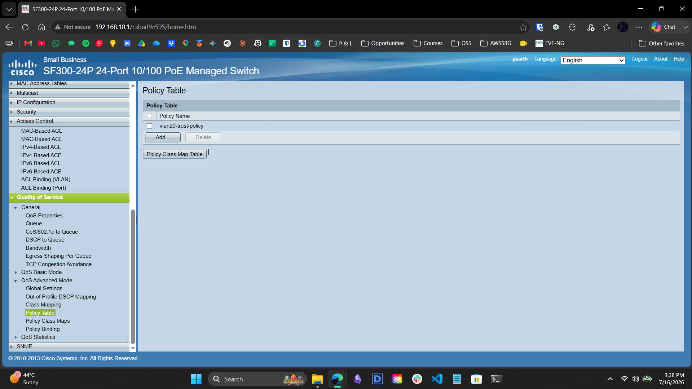
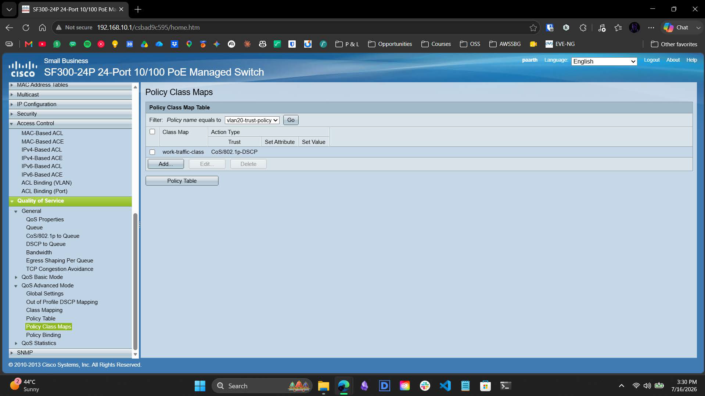
*The `vlan20-trust-policy` was initialized and mapped to the `work-traffic-class`. We set the action to `Trust CoS/802.1p-DSCP` and bound the policy to FE24. This forces the switch to honor native Windows DSCP markings.*

### 3. Act III: The Cryptographic Telemetry Enclave
We established an encrypted SNMPv3 monitoring pipeline, ensuring that all health data (CPU, Uptime, Interface stats) is hashed and encrypted before traversing the network.

**SNMPv3 Engine Initialization:**
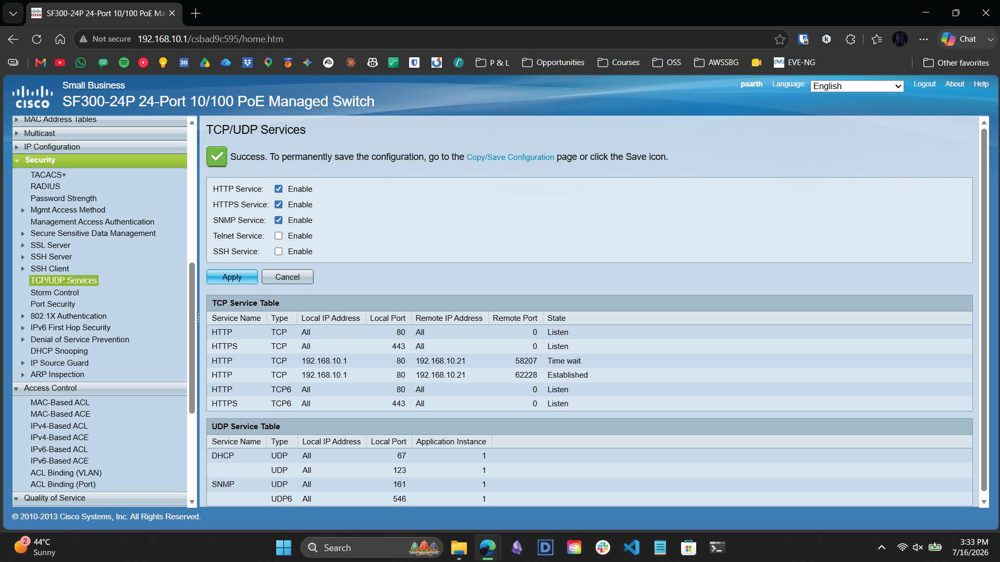
*Defining a custom SNMP `telemetry-view` restricted to root OID `1`. This provides the monitoring server with necessary visibility while sandboxing the switch against unauthorized write operations.*

**AuthPriv Security Model Assembly:**
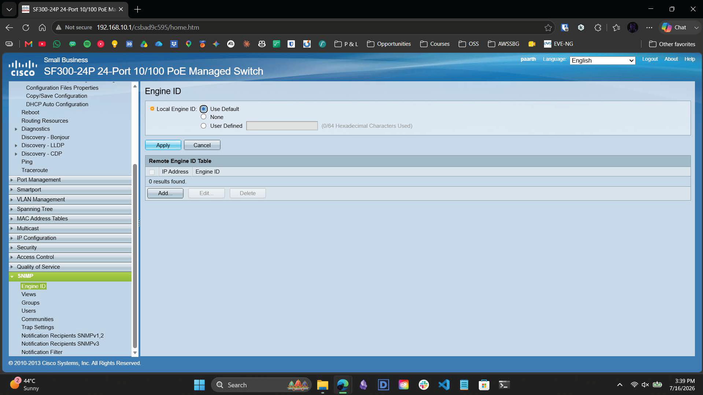
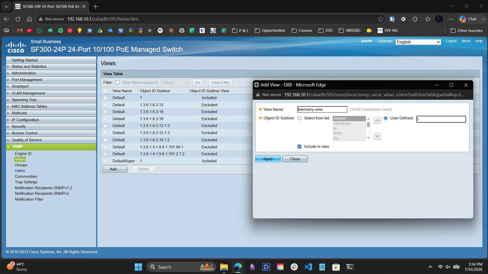
*Constructing the `snmpv3-secgroup` and provisioning the `snmp-admin` user, enforcing **SHA** for HMAC authentication and **DES** for payload encryption.*

### 4. Act IV: Architectural Tradeoffs & Final Validation
To accommodate the new security fabric within the ASIC's volatile memory, we purged legacy Project 2 ACLs. Final validation was performed using the Paessler SNMP Tester and Wireshark.

**SNMPv3 Authentication Success:**
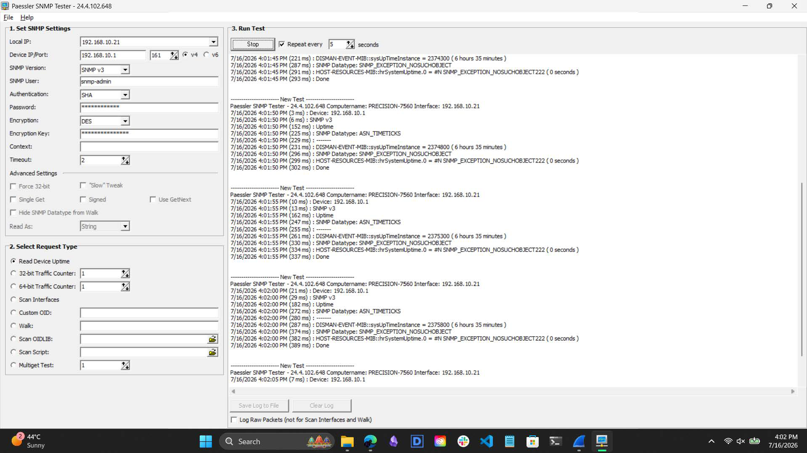
*The Paessler SNMP Tester successfully authenticated via AuthPriv and polled `sysUpTimeInstance` (40,049 seconds), confirming the encryption tunnel is functional.*

**Data Plane DSCP Validation:**
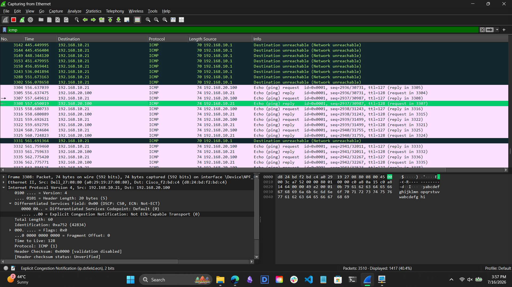
*Wireshark inspection of the destination host confirming that native `CS0` DSCP tags successfully transited the Marvell ASIC routing engine without being stripped by the switch hardware.*

---

## Technical Specifications

* **Core L3 Engine:** Cisco SF300-24P (ASIC Filtering: ENABLED)
* **QoS Fabric:** Trust CoS/802.1p-DSCP | Ingress: Port FE24
* **Telemetry Fabric:** SNMPv3 (Auth: SHA | Priv: DES)
* **Monitoring Scope:** Read-Only (`telemetry-view` / OID `1`)
* **Persistence:** NVRAM-committed configuration

---

## Contact

For any questions or feedback, reach out:  
**Paarth Pandey** | [LinkedIn](https://www.linkedin.com) | [GitHub](https://github.com) | paarthdxb@gmail.com

---

> Author: Paarth Pandey
> 
> Enterprise IT/OT Infrastructure Security Lab Portfolio
