# Infrastructure Build Guide: Cisco SF300 L3 Multilayer Architecture

> A visual narrative documenting the bare-metal provisioning, control plane debugging, and definitive hardware routing validation of a legacy Cisco multilayer switch.

---

## Overview

This guide provides a comprehensive breakdown of configuring a Cisco SF300-24P switch in a pure Layer 3 architecture. It details the transition from initial hardware reset to overcoming legacy OpenSSH deprecation, deploying Out-of-Band (OOB) serial management, resolving firmware SVI Autostate logic, and securing Host-OS firewall rules to validate true hardware-accelerated Inter-VLAN routing.

---

## Workflow Steps

### 1. Initialization and Mode Pivot
The switch was subjected to a physical factory reset and NVRAM purge. Accessing the initial GUI, the System Mode was explicitly toggled from Layer 2 to Layer 3, unlocking the device's hardware routing capabilities. Identity hardening and system time synchronization were established to baseline the logs.

**System Mode Pivot & Hostname Definition:**
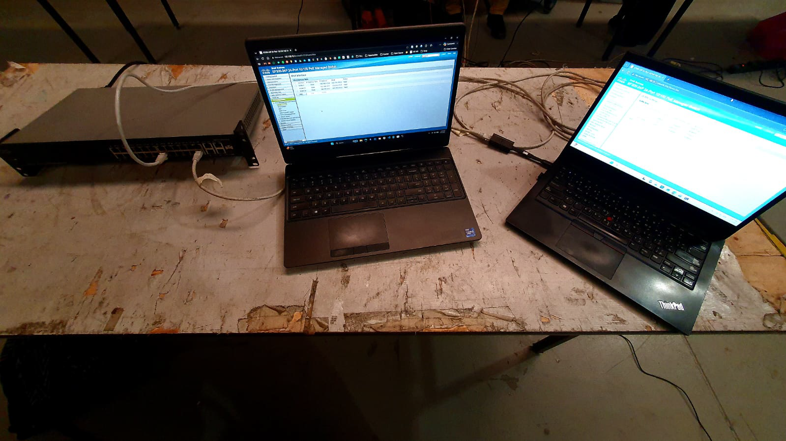

**System RTC Time Synchronization:**
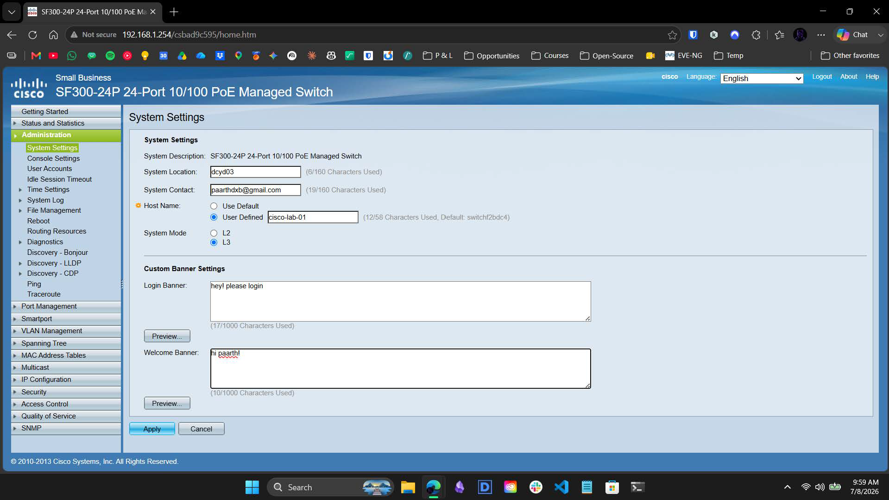

### 2. Access Hardening and the Legacy Crypto Wall
Standard protocol dictates disabling default accounts. We created a local `paarth` profile with Privilege Level 15 (Read/Write Management Access) and wiped the default `admin` profile. 

**Establishing Priv 15 User Credentials:**
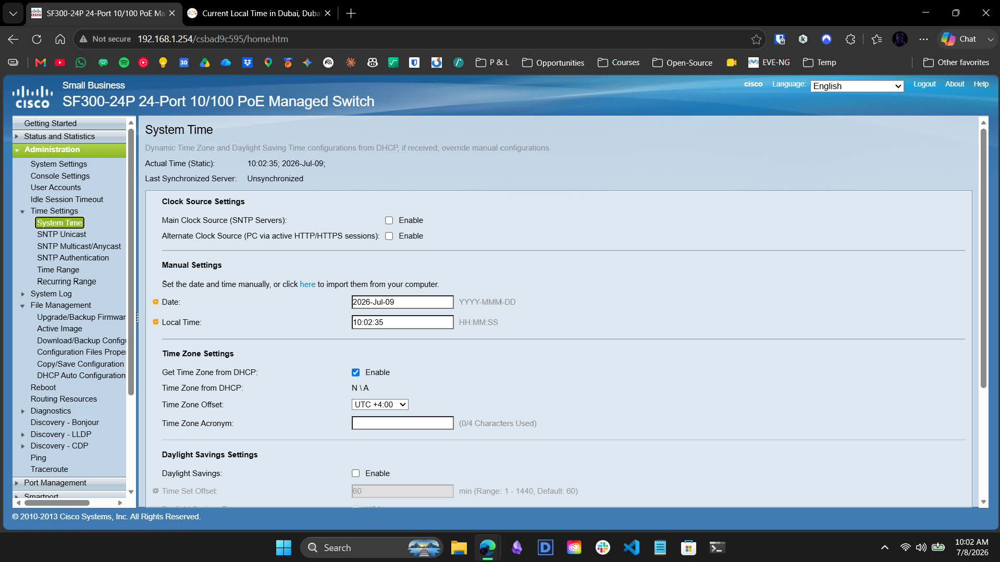
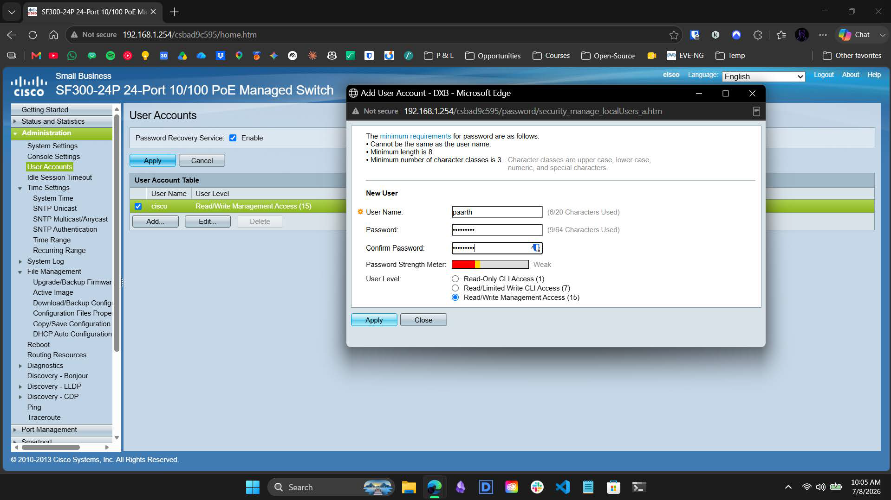

When shifting to CLI provisioning, modern Windows OpenSSH rejected the switch's 2010-era cryptography. We executed a manual override string to bypass these security blocks. However, the heavy AES-256 overhead exhausted the switch CPU during ASIC routing updates, causing daemon crashes. We subsequently pivoted to an Out-of-Band (OOB) serial console connection to safely inject the L3 configuration without crypto-overhead.

**SSH Server Authentication & Legacy Protocol Negotiation:**
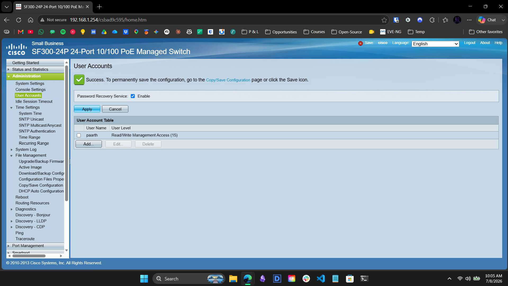

### 3. L2 Segmentation and SVI Autostate Discovery
Using our stable OOB console and GUI access, we instantiated the Layer 2 boundaries. We created VLAN 10 (`home-net`) and VLAN 20 (`work-net`) in the database, mapping physical ports FE19 and FE24 as untagged access ports.

**VLAN Database Activation Status:**
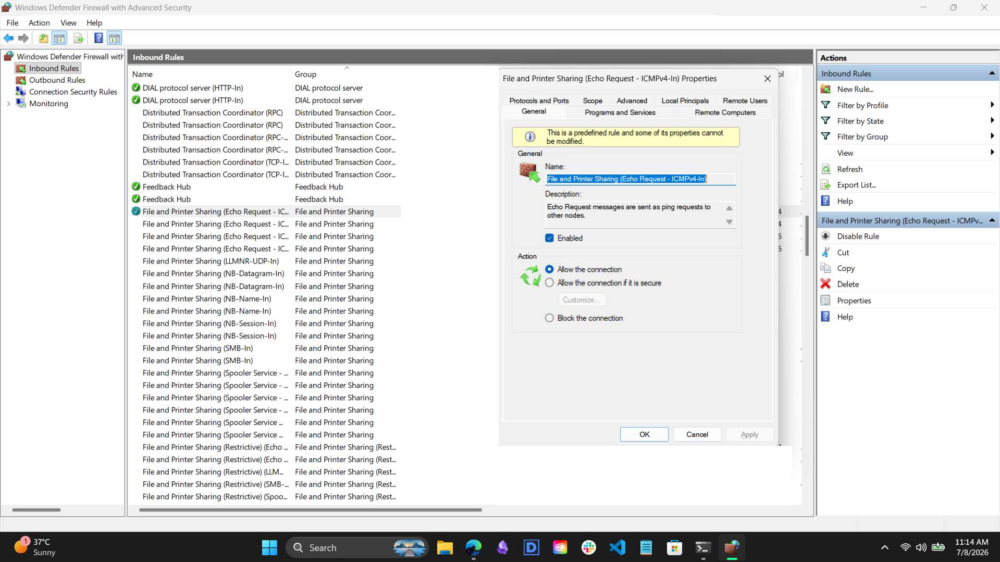

**Port-to-VLAN Membership Mapping:**
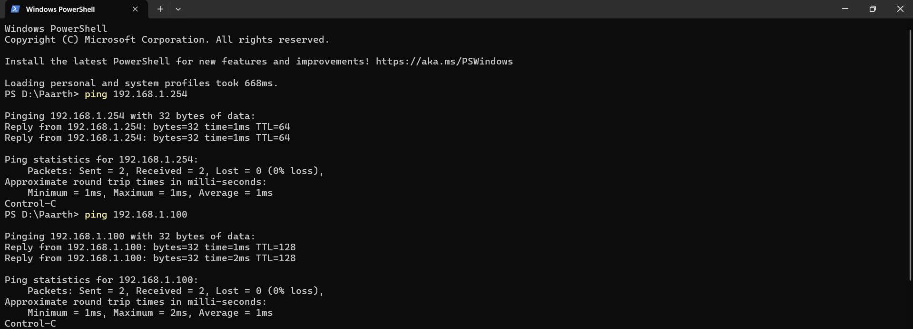

During this phase, we encountered SVI Autostate: the logical routing interfaces refused to activate until physical link (electrical signals) were detected on the respective access ports.

### 4. L3 Engine Provisioning (The Control Plane)
With L2 established and physical links hot, we verified the Switch Virtual Interfaces (SVIs). IP addresses `192.168.10.1` and `192.168.20.1` were bound to the VLANs. The IPv4 Interface table confirmed their status as "Valid" and "UP".

**SVI Gateway Provisioning Status:**
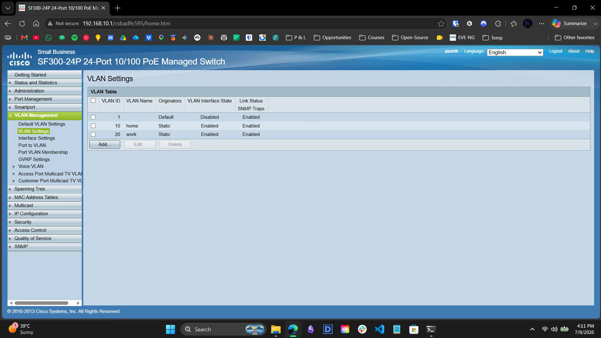

The ultimate proof of the control plane configuration was verifying the switch's internal brain. The Routing Information Base (RIB) successfully processed the SVIs and injected the `192.168.10.0/24` and `192.168.20.0/24` subnets as "Directly Connected" routes.

**ASIC Routing Table (RIB) Verification:**
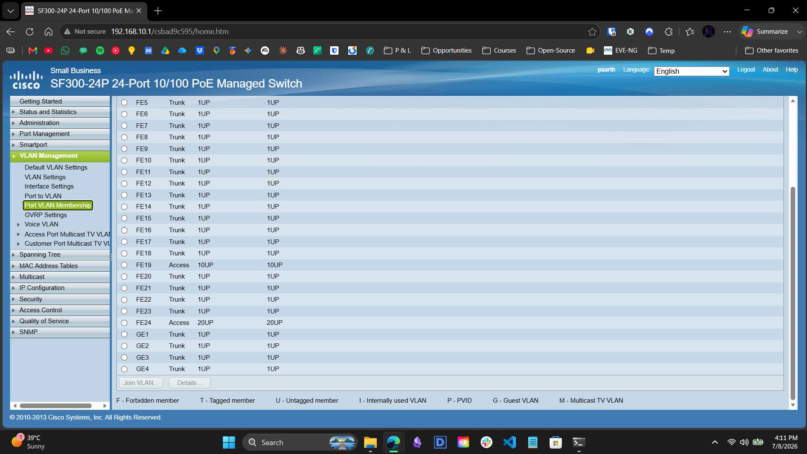

### 5. Host-OS Firewall Remediation
Initial Inter-VLAN ICMP verification failed despite a perfect routing table. Diagnostics isolated the issue to the Windows OS: switching subnets triggered a "Public" network profile, causing the Windows Defender Firewall to drop packets originating from a "Foreign" subnet. We manually expanded the ICMPv4 Inbound Rule Scope to explicitly trust the `192.168.20.0/24` block.

**Windows Firewall Subnet Scope Expansion:**
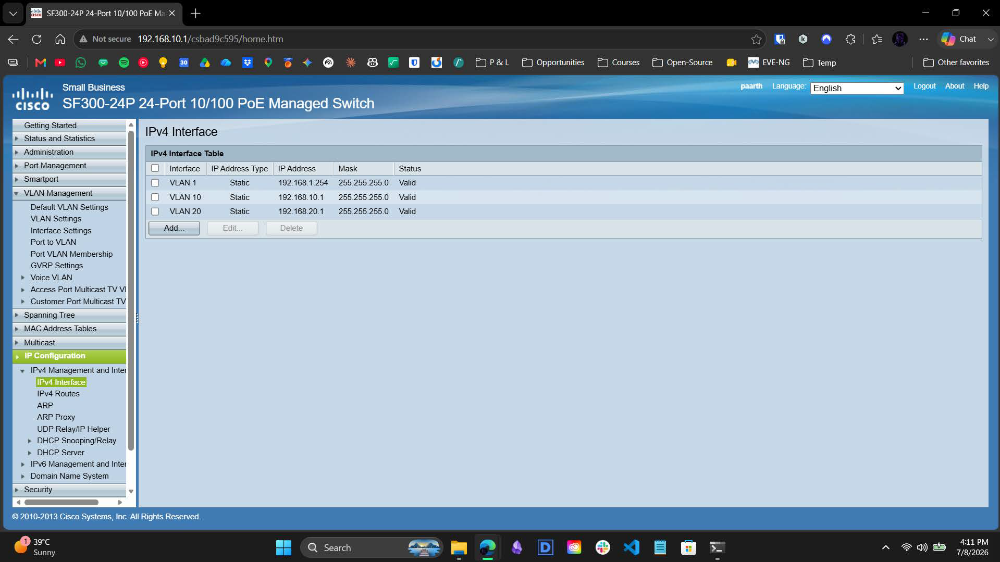

### 6. Data Plane Validation (The 2-Hop Trace)
Initially, testing with a multi-homed laptop (two NICs on one machine) yielded a 1-hop `<1ms` traceroute. We diagnosed this as the **Windows "Weak Host" Model**, where the OS kernel routes packets internally in CPU memory, bypassing the switch entirely.

**Host OS Loopback Diagnostic:**

To capture authentic hardware validation, we deployed a strict two-host physical topology. Executing a traceroute from Host A (`192.168.10.150`) to Host B (`192.168.20.100`) forced the packets out onto the wire.

**The Definitive 2-Hop Hardware Trace:**
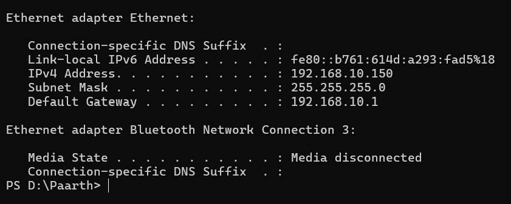

* **Hop 1:** `192.168.10.1` (Traffic hit the Cisco Switch ASIC Gateway).
* **Hop 2:** `192.168.20.100` (Traffic was successfully routed across the backplane to the isolated broadcast domain).

**Host OS IP Configuration Verification:**
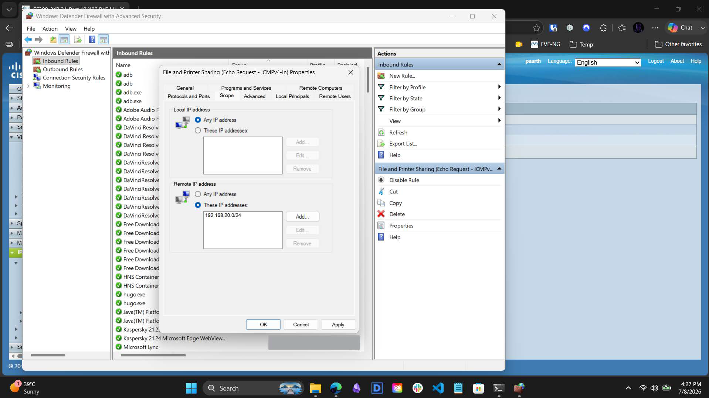
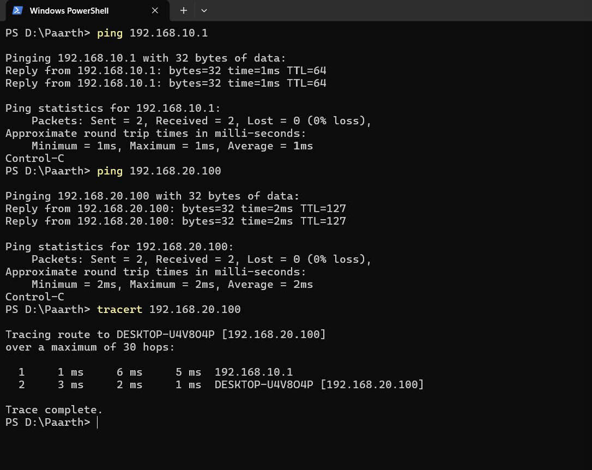

---

## Contact

For any questions or feedback, reach out:  
**Paarth Pandey** [LinkedIn](https://www.linkedin.com) | [GitHub](https://github.com) | paarthdxb@gmail.com

---

> Author: [Paarth Pandey](https://github.com)
>   
> OT Security Labs: Industrial Network Defense
